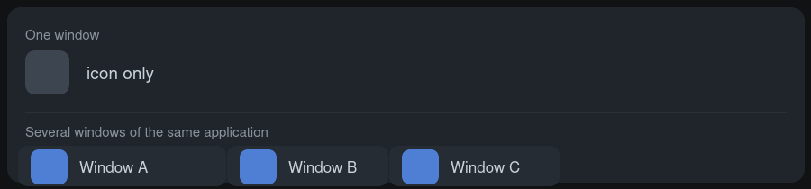

# Smart Tasks

**An icon-only task manager for KDE Plasma 6 that shows a window title only when an
application has more than one window.**

> **What it is** — a drop-in extra panel widget, a fork of Plasma's built-in *Icons-Only
> Task Manager*. Icons everywhere, plus text exactly where the icon cannot help you: every
> window keeps its own button, and an application with several windows gets one labelled
> button per window, so you can click the right one straight away.
>
> **Why it exists** — Plasma ships two task widgets and both are all-or-nothing: *Task
> Manager* always shows icon **and** text, *Icons-Only Task Manager* never shows text (and
> merges an app's windows into a single button). There is no setting for "text only when
> needed" — see [Why this exists](#why-this-exists).
>
> **Status** — v1.0.0, developed and tested on **Plasma 6.7.5**. Pure QML, nothing to
> compile. GPL-2.0-or-later. Bugs and ideas: [issues](https://github.com/ckilb/plasma-smart-tasks/issues).

This is an actual panel, not a mock-up: two KWrite windows are open, so both get a labelled
button with their file name, while every single-window application next to them stays a bare
icon.


| Your situation | What the panel shows |
| --- | --- |
| App not running (pinned launcher) | icon |
| App with **one** window | icon only — no wasted space |
| App with **two or more** windows | **one button per window**, each icon + its own window title |



Read the title, click once, get the window you meant: no hovering for a thumbnail, no
clicking through a group, no permanent text on tasks that don't need it.

## Why this exists

Plasma's two task widgets are literally the same QML code base — the only difference is a
hardcoded flag:

```qml
readonly property bool iconsOnly: Plasmoid.pluginName === "org.kde.plasma.icontasks"
```

So you get either *always text* or *never text*. The config schemas in Plasma 6.7 (and in
current master) contain no text/label toggle at all, and the upstream wishlist items in this
area have been open for years:

* [bug 391572](https://bugs.kde.org/show_bug.cgi?id=391572) — per-task "show icon only,
  keep labels for the others"
* [bug 448912](https://bugs.kde.org/show_bug.cgi?id=448912) — merge both widgets into one
  with a mode switch

Smart Tasks fills that gap with a small, self-contained patch: keep the icon-only layout and
add the window title exactly where the icon alone carries no information — on applications
that have several windows.

## Requirements

* **KDE Plasma 6** — developed and tested against Plasma 6.7.5. The QML is a copy of that
  release's widget, so older 6.x versions will most likely work but are untested.
* X11 or Wayland, any architecture — the widget is pure QML and ships no binaries.

## Install

### 1. Get the widget file

Download **`plasma-smart-tasks-1.0.0.plasmoid`** from the
[latest release](https://github.com/ckilb/plasma-smart-tasks/releases/latest).

The file is a zip archive: that is the package format KPackage in Plasma 6 can open
(gzipped tar packages are no longer accepted). The release also carries the identical file
as `.zip`.

### 2. Install it

Either use the GUI:

> right-click your panel → **Add Widgets…** → **Get New Widgets…** →
> **Install Widget From Local File…** → pick the downloaded `.plasmoid`

or the command line:

```sh
kpackagetool6 --type Plasma/Applet --install plasma-smart-tasks-1.0.0.plasmoid
```

### 3. Put it on the panel

Remove the old task widget from your panel and add **Smart Tasks** in its place. Pinned
launchers, icon spacing and the other per-widget settings start with their own defaults, so
re-pin the launchers you want.

### Update / uninstall

```sh
# update to a newer release
kpackagetool6 --type Plasma/Applet --upgrade plasma-smart-tasks-<version>.plasmoid

# remove
kpackagetool6 --type Plasma/Applet --remove io.github.ckilb.smarttasks
```

### Build it yourself

```sh
git clone https://github.com/ckilb/plasma-smart-tasks.git
cd plasma-smart-tasks
./build.sh                                       # writes dist/*.plasmoid and dist/*.zip
kpackagetool6 --type Plasma/Applet --install dist/plasma-smart-tasks-1.0.0.plasmoid
```

## Settings

The widget has the same settings pages as the built-in task manager, minus the options that
only make sense with permanent text:

* **Appearance → *Show window titles for apps with more than one window*** — the switch for
  the behaviour above. Turn it off and you get exactly the stock icon-only widget.
* **Appearance** — *Spacing between icons*, *Fill free space on panel*, multi-row view.
* **Behavior** — *Group:* is fixed to "Do not group" while smart labels are on, because
  grouping would merge the very windows the labels are meant to tell apart.

## How it works

Three small changes on top of the stock widget:

```qml
// main.qml — how many windows does each application have right now?
readonly property var windowCounts: { /* counts rows per AppId */ }

// Task.qml — a window's title is only shown when its app has several windows
readonly property bool labelWanted: tasksRoot.smartLabels && isWindow && !model.IsStartup
    && tasksRoot.windowCountFor(appId, model.LauncherUrlWithoutIcon) > 1

// Task.qml — labelled tasks may grow by the width of a title, others stay square icons
Layout.maximumWidth: ... LayoutMetrics.preferredMaxWidth(labelWanted)
```

A single task delegate cannot see its siblings, so the per-application window count is
computed once in `main.qml` and re-evaluated whenever windows come and go. The label itself
reuses the stock label element, so it shows the window title, elides or wraps like the
regular Task Manager, and is dropped again when the panel runs out of room.

## Differences from the built-in widget

The widget is installed as a user package, which means it cannot ship compiled C++ code.
Two C++ classes of the built-in applet are therefore replaced by QML equivalents:

| Built-in | Replacement | Consequence |
| --- | --- | --- |
| `Backend` — jump lists, Places, recent documents, icon geometry, drag & drop | `contents/ui/Backend.qml` | icon geometry for minimise animations/window previews and launcher drag & drop still work; the *jump list*, *Places* and *Recent Files* submenus of the right-click menu are empty |
| `SmartLauncherItem` — activity-manager badge counts, KJob progress | `contents/ui/SmartLauncherItem.qml` | no count badge and no progress ring on launcher icons; attention is still driven by the window's own state |

Everything else is unchanged: pin/unpin, window controls, moving windows between desktops and
activities, closing, tooltips and previews, audio indicators, middle-click actions,
"Fill free space", multi-row view.

Because the upstream QML uses Plasma-internal modules, the private
`plasma.applet.org.kde.plasma.taskmanager` import was replaced by direct imports of the
widget's own JavaScript files (as Plasma 5 did before those files were compiled in). The
widget is a self-contained copy, so a Plasma update cannot break it half-way — but it also
means it will not automatically pick up upstream changes; rebuild from a newer
`plasma-desktop` source if you want those.

## Repository layout

```
package/
├── metadata.json                    widget id, name, description
└── contents/
    ├── config/                      main.xml (settings schema), config.qml (settings pages)
    └── ui/                          QML, with code/LayoutMetrics.js and code/TaskTools.js
build.sh                             builds dist/*.plasmoid and dist/*.zip
docs/panel.png                       the panel screenshot above
docs/behaviour.png                   the schematic diagram
```

The QML is derived from `plasma-desktop/applets/taskmanager` (Plasma 6.7.5,
GPL-2.0-or-later). Files that differ from upstream:

| File | Change |
| --- | --- |
| `ui/Task.qml` | `labelWanted`, label visibility, `preferredMaxWidth(labelWanted)` |
| `ui/main.qml` | `iconsOnly: true`, `smartLabels`, `windowCounts`/`windowCountFor()`, grouping disabled while smart labels are on |
| `ui/code/LayoutMetrics.js` | `preferredMaxWidth(needsLabel)`, `smartLabelSpace()` |
| `ui/ConfigAppearance.qml`, `ui/ConfigBehavior.qml` | new checkbox, text-only options hidden |
| `ui/Backend.qml`, `ui/SmartLauncherItem.qml` | QML-only replacements for the C++ classes above |
| `ui/TaskBadgeOverlay.qml`, `ui/ContextMenu.qml` | minor adaptations (no private C++ module) |

Upstreaming the behaviour would be a matter of adding the `smartLabels` config entry and the
label condition above — the feature is deliberately a small, self-contained diff, and it was
written so that it can be proposed to Plasma as-is.

## License

GPL-2.0-or-later, like the Plasma code it is derived from. See [LICENSE](LICENSE).
